# TerraformでEC2を使ったweb環境をつくろう
基本構成は下記の通り
Route53 + ALB + Cloud Watch logs + S3 + RDS + EC2(nginx + php-fpm + Laravel)



docker  
https://github.com/okdyy75/dev-laravel-docker

laravel  
https://github.com/okdyy75/dev-laravel

terraform  
https://github.com/okdyy75/dev-laravel-terraform


## 実行環境構築
### awsのconfig設定
```
> aws configure --profile dev-user
AWS Access Key ID [None]: XXXXXXXXXXXXXXXX
AWS Secret Access Key [None]: XXXXXXXXXXXXXXXX
Default region name [None]: ap-northeast-1
Default output format [None]: json

cat ~/.aws/config

# aws-cliを使う際はuserを設定
export AWS_DEFAULT_PROFILE=dev-user
```

### terraformインストール
```
brew install terraform

> terraform -v
Terraform v0.12.28
```

### Terraformのログを残すように設定
```
vi ~/.bash_profile

# terraform
export TF_LOG=DEBUG
export TF_LOG_PATH='./terraform.log'
```

## Terraform実行前に
- ドメインを取得しておく。自分はフリーのものを使用した。
- S3等に接続できるWEB用のAWSアカウントを作成する
- route53でドメインを作成する
- example.tfvarsを参考に各環境ごとに「xxx.tfvars」を作成

## Terraform実行
```
# 一番最初に実行する際はinit
terraform init

# 計画
terraform plan -var-file=dev.tfvars

# デプロイ
terraform apply -var-file=dev.tfvars

# 破棄
terraform destroy -var-file=dev.tfvars
```

## 作成したWebサーバーにSSM経由でログインする

### EC2で使う鍵を作成しておく
```
mkdir .ssh
ssh-keygen -f .ssh/xxxx
```

### macOS に Session Manager plugin をインストール
下記リンク通り実行
https://docs.aws.amazon.com/ja_jp/systems-manager/latest/userguide/session-manager-working-with-install-plugin.html#install-plugin-macos

SSM経由でアクセス
```
aws ssm start-session --target [EC2のインスタンスID]
```

sshで簡単にログインできるように下記設定
```
vi ~/.ssh/config

# SSH over Session Manager
host i-* mi-*
    ProxyCommand sh -c "aws ssm start-session --target %h --document-name AWS-StartSSHSession --parameters 'portNumber=%p'"
```

SSM経由でsshアクセス
```
ssh -i .ssh/web_id_rsa ec2-user@[EC2のインスタンスID]
```

## EC2にsshしてWeb、DB、S3と接続できるか確認
http://dev-laravel.okdyy75.ga/api

```
# DBのテスト
php artisan migrate
php artisan migrate:rollback

# S3のテスト
echo "テストです！" > storage/test.txt
php artisan test:s3 store test.txt
```


## Terraform TIPs
- resource名はケバブケースで書こう。（resource名とnameを合わせた時にアンダーバーが使えない場合が多々あり）
- 上記に合わせて変数名はスネークケースで書こう。


## 感想

次は下記を導入していきたいです
- デフォルトユーザーを変える(ec2-user)
- httpsでの接続
- ECSで作成
- 秘匿情報をパラメーターストアで管理
- RDSの追加
- メールサーバーの設定
- VPNの導入
- 本番運用を想定した記述。tfstateの管理


## 参考にさせて頂いた資料
- [はじめての人のための Terraform for AWS](https://booth.pm/ja/items/1891536)
- [Pragmatic Terraform on AWS](https://booth.pm/ja/items/1318735)
